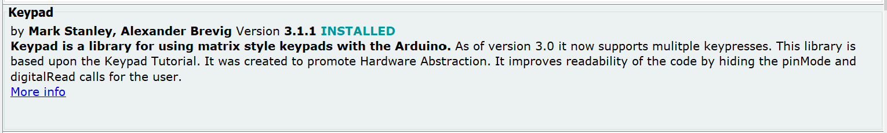
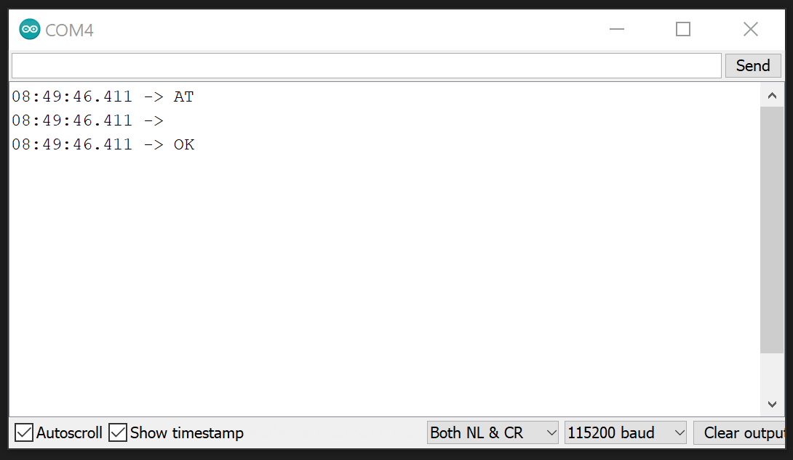

# Hotel-Safe-Client

The Hotel-Safe-Client is the program, which runs on the `Arduino UNO`. The programming language of Arduino is based on `C++`.

## Required Libraries

In oder to run the code, several libraries have to be installed manually. Arduino does not offer any kind of dependency management as node.js (or npm) does. **Make sure to use the correct version.**

> **HOW TO:** Arduino IDE - Tools > Manage Libraries...

| Libraries                                                   |
| ----------------------------------------------------------- |
|    |

## Informations ESP8266

To view the Serial console of the `ESP8266` open the Serial Monitor of the Arduino Uno and configure it as following.

[=> AT Command Reference](http://room-15.github.io/blog/2015/03/26/esp8266-at-command-reference/)
